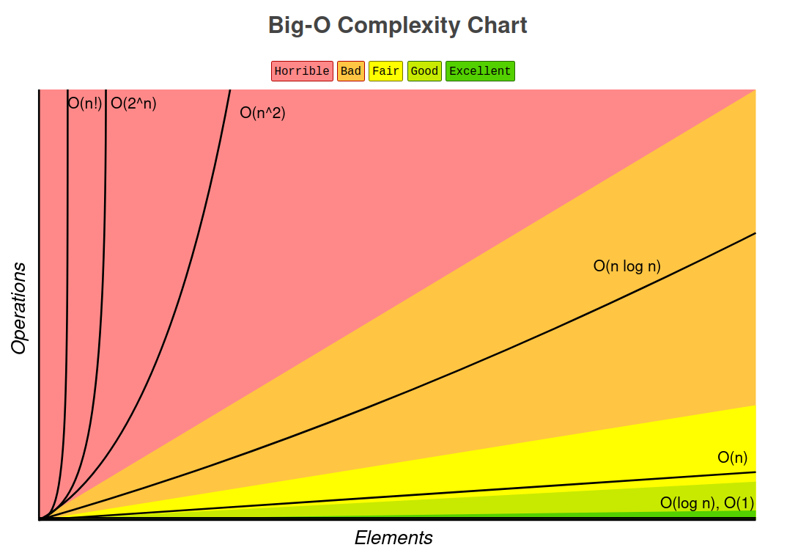

# Algorithms and data structures

This note is written from the content of The Last Algorithms Course You'll neeed by Frontend Masters and ThePrimeagen.

This course includes:
- Algorithms
- Data structures
- Time and space complexity
- Typescript is used in this course

## Recommended books

1. The Introduction to Algorithms
2. For Programmers Who Don't Know How to DataStructure And Would Like To Do Other Things Well Too

## Big O notation

Big O notation categorizes algorithm's time or space (memory) requirements based on input size. Big O is not meant to be used as an exact measurement, it's a way generally classify and measure the efficiency of an algorithm by its growth, as the input size grows. Usually only the upper bound is provided, meaning that only the worst case scenario is provided by the notation.

You can ask: "as your input grows, how fast does computation or memory grow?"

We can use this information to make decisions what data structures and algorithms to use. With the performance information, we can create a better program.

Important note: growth is with respect to the input.

### Example 1

How does the function execution time grow with respect to input?

```typescript
function sum_char_codes(n: string): number {
    let sum = 0;
    for (let i = 0; i< n.length; ++i) {
        sum += n.charCodeAt(i);
    }

    return sum;
}
```

The answer: O(n).

How do you come that conclusion? With a simple trick: look for loops. Check how the loop is iterated and how many loops are there in the function and if they are nested.

### Example 2

If the previous one was O(n), what's the following function's O notation?

```typescript
function sum_char_codes(n: string): number {
    let sum = 0;
    for (let i = 0; i< n.length; ++i) {
        sum += n.charCodeAt(i);
    }

    for (let i = 0; i< n.length; ++i) {
        sum += n.charCodeAt(i);
    }

    return sum;
}
```

Answer: O(n).

Why this is also an O(n) if there are two loops instead of one? Shouldn't it be something like O(2n)? Kinda, but in Big O notation, constants (like the constant 2) aren't used so O(2n) becomes O(n). Only the base constant of one which isn't explicitly shown, and this is because the Big O notation is usually tested towards really big numbers and/or infinity. With large numbers the constants become irrelevant. Especially when compared to exponents. Also, it needs to be remembered that Big O notation is always just an approximation.

### Example 3

```typescript
function sum_char_codes(n: string): number {
    let sum = 0;
    for (let i = 0; i< n.length; ++i) {
        const charCode = n.charCodeAt(i);
        // Capital E
        if (charCode === 69)
            return sum;
        }

        sum += charCode;
    }

    return sum;
}
```

Answer: O(n).

Why, even though we aren't always using all letters? It's because usually we cover only the worst case so with the function above we would consider the case when there are no letter Es. Also, we drop all constants as with the previous example, something like O(n-5) becomes O(n).

### Important concepts to remember

1. Growth is with respect to the input
2. Constants are dropped
3. Worst case is *usually* the way we measure

## Common complexities



From fastest to slowst:

1. O(1): constant time, same operation everytime regardless of the input size
2. O(logn): base two log
3. O(n): grows linearly
4. O(nlogn): very common running time
5. O(n²): start growing fast
6. O(2^n): can't be run on traditional computers
7. O(n!): can't be run on traditional computers

### O(n²)

```typescript
function sum_char_codes(n: string): number {
    let sum = 0;
    for (let i = 0; i< n.length; ++i) {
        for (let j = 0; j < n.lenth; ++j) {
            sum += charCode;
        }
    }

    return sum;
}
```

### O(n³)

```typescript
function sum_char_codes(n: string): number {
    let sum = 0;
    for (let i = 0; i< n.length; ++i) {
        for (let j = 0; j < n.lenth; ++j) {
            for (let k = 0; k < n.lenth; ++k) {
                sum += charCode;
            }
        }
    }

    return sum;
}
```

### O(n log n)

Every time you go over the input, you half the input size, and iterate again and half it again.

- Quicksort 

### O(log n)

- Binary search trees

## Data structures

### Array

If `const a = []` is NOT an array, what is it?

Array is a contiguous and set memory space. Contiguous meaning that it is unbreaking from the array's starting point to its ending point, and set being that it hold a certain amount of bytes. The computer does not understand what an array is, everything is actually just bytes, zeros and ones within computers. So when working with arrays, we need give the array meaning ourselves by i.e. telling how many bytes a single array item can hold. If we treat is as a 32-bit space, it holds four bytes. How do we tell how big of an array is? Usually we can give an array a size. For example, in Java we can write this like `int[3]`. This is an array of integers with the size of three. By default, `int` is a 32-bit signed integer meaning that the single number can have a minimum value of -2³¹-1 and a maximum value of 2³¹-1. With arrays, you can't change the size of the array afterwards. Later, there comes other data structures that has the ability to change the size of itself dynamically but they aren't arrays anymore (even though these data structures may be impelemented with arrays under the hood.

#### Example 1

```typescript
> const a = new ArrayBuffer(6)
undefined
> a
ArrayBuffer { [Uint8Contents]: <00 00 00 00 00 00>, byteLength: 6 }
> const a8 = new Uint8Array(a)
undefined
> a8[0] = 45
45
> a
ArrayBuffer { [Uint8Contents]: <2d 00 00 00 00 00>, byteLength: 6 }
> a8[2] = 45
45
> a
ArrayBuffer { [Uint8Contents]: <2d 00 2d 00 00 00>, byteLength: 6 }
> const a16 = new Uint16Array(a)
undefined
> a
ArrayBuffer { [Uint8Contents]: <2d 00 2d 00 00 00>, byteLength: 6 }
> a16[2] = 0x4545
17733
> a
ArrayBuffer { [Uint8Contents]: <2d 00 2d 00 45 45>, byteLength: 6 }
```

What's happening here is that the `ArrayBuffer` is just a contiguous memory area without any information regarding its contents other than that they are bytes. We need a way to interpret these bytes in an organized way which is where the `Uint16Array` comes into play. `Uint16Array`is a _typed_ array which gives the meaning to the `ArrayBuffer`. We also have `Uint16Array` which interprets and handles the `ArrayBuffer` in a different way than `Uint8Array` even though both arrays handle the same buffer. The `ArrayBuffer` is an 8-byte buffer by default. That's why, when we first handled the buffer with `Uint8Array`, we go each slot one by one but when we changed into `Uint16Array` the buffer was being iterated by two 8-bit slots at once. That's why `a16[2]` put the hexadecimal value of `17733` into the fifth slot of the array buffer. And because the `17733` hexadecimal value consists of two `45`, `0x4545`, the value gets overflown into the sixth slot in the array from the fifth slot.

When getting or setting elements into array, it's runtime is O(1) so it's constant.

Things to remember:
- Arrays are fixed size, contiguous memory chunks
- You can't grow arrays
- There are no `insertAt`, `push` or `pop` functions

## Algorithms

### Search

#### Linear search

We have an array `a` from `0` to `n`. We also have a function `search(array, value)`. We can iterate over the array's elements and check if the iterated element's value is the passed `value` of the function.

What's the big O notation of this algorithm?

Answer: O(n).

```typescript
function linear_search(haystack: number[], needle: number): boolean {
    for (let i = 0; i < haystack.length; ++i) {
        if (haystack[i] === needle) {
            return true;
        }
    }

    return false;
}            
```

#### Binary search

We have a _sorted_ array `a` from `0` to `n`. We also have a function `search(array, low, high)`. We can iterate over the array by halving the array and asking if the value is higher or lower than the current number. We can do this over and over again until we find our value.

What's the big O notation of this algorithm?

Answer: O(log n).

Notes from Wikipedia about logarithm:
- The logarithm is the _inverse_ function to exponentiation. That means the logarithm of a number `x` to the base `b` is the exponent to which `b` must be raised to produce `x`. For example, since `1000 = 10³`, the _logarithm base_ 10 of 1000 is 3, or `log₁₀(1000) = 3`. The logarithm of `x` to base `b` is denoted as `logb (x)`, or without parentheses, `logb x`, or even without the explicit base, `log x`, when no confusion is possible, or when the base does not matter such as in big O notation.
- The logarithm base 10 is called the decimal or common logarithm and is commonly used in science and engineering. The binary logarithm uses base 2 and is frequently used in computer science. `log₂ 16 = 4` since `2 x 2 x 2 x 2 = 16`.

##### Pseudocode

```
do {
    index = floor(low + (high - low) / 2)
    value = array[index]
    if value = needle
        return true
    else if value > index
        low = index + 1
    else
        high = index
} while(low < high) {
    return false 
}
``` 

Notes:
- `[low, high)`: low is always inclusive, high is always exclusive.

##### Real code

```typescript
export default function bs_list(haystack: number[], needle: number): boolean {
    let low = 0;
    let high = haystack.length;

    do {
        const index = Math.floor(low + (high - low) / 2);
        const value = haystack[index];

        if (value === needle) {
            return true;
        } else if (value > needle) {
            high = index;
        } else {
            low = index + 1;
        }
    } while (low < high);

    return false;
}
```

### Two crystal ball problem

> Given two cystal balls that will break if dropped from high enough distance, determine the exact spot in which it will break in the most optimized way.

When this problem is generalized and visualized, it's actually pretty simple. You could visualize this as an array:

```typescript
[false, false, false, ..., true (starts to break), true, true, ..., true]
```

If we would try to find the first `true` in the array, we could find it through linear search but its runtime approximation would be O(n) and it wouldn't use the fact that there are two(!) crystal balls that well. First, the array is sorted, because there are only `false` (same as `0`) values which get followed by `true` (same as `1`) values.
