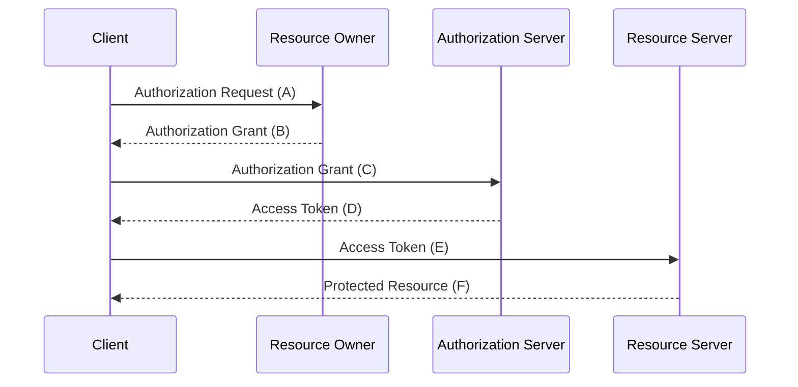

# OAuth 2.0

## Introduction

To understand the need for OAuth, we'll first need to understand the background and history of the problem it solves.

### Background

When you want to grant a third-party application access to your account and the data it contains, the third-party app needs a way to authenticate itself to the server. Before OAuth, the only way to do this was to share your username and password with the third-party app. For example, if you wanted to give a third-party app access to your Twitter account back then, you would have to share your Twitter username and password with the app, so it could log in a retrieve the data it needed from your account for some purpose, i.e. posting tweets on your behalf etc. This was a huge security risk, as you were essentially giving the third-party app full access to your account, and if the app was malicious, it could do a lot of damage. Also, passwords were often stored in plain text, which made them easy to steal and harvest, and even change the password to lock you out of your own account. The way to revoke access to the third-party app was to change your password, which isn't a very user-friendly way to manage access to your account.

### History

Due to the problems mentioned above, many services started to implement their own authorization mechanisms (FlickrAuth, AuthSub, BBAuth, etc.), which were all different and incompatible with each other. To tackle this problem, a group of people got together, formed a discussion group, and created **a standard for API access control**, which they called OAuth 1. OAuth Core 1.0 was released in December 2007. A few years later, the OAuth specification work was moved to the IETF.

OAuth 1 was a good start, but it had some problems. It was complex, hard to implement, and had some security issues. So, the group went back to the drawing board and created OAuth 2.0, which was released in October 2012. OAuth 2.0 is a much simpler and more secure protocol than OAuth 1, and it has become the de facto standard for API access control.

## How OAuth Works

Here's a top level sequence diagram of how OAuth works:

Next, we'll go through each step in the sequence diagram.

### Register your application

To get an access to an OAuth 2.0 API/service, you'll usually need to **register your application** to the service. This will give you a `client_id` and a `client_secret`, which you'll use when interacting with the service. This note will use the term "client" to refer to your application from now on due to it being the official term used in the OAuth 2.0 specification.

### Register a redirect URI

You'll also need to **register a redirect URI**, which is where the user will be redirected after the client has been authorized to access a protected resource. The redirect URI must be an HTTPS endpoint to prevent interception of the authorization code and with that, session hijacking. Loopback addresses (localhost) is an exception to this rule even though some services might not allow it. 

### Prepare the authorization request

When you want to access OAuth 2.0 protected resources, you'll need to send an authorization request to the service's authorization endpoint. The authorization request is a URL that contains the following parameters:

- `response_type`: The value must be `code`.
- `client_id`: The client ID received during client registration.
- `redirect_uri`: The redirect URI you registered.
- `scope`: A space-separated list of scopes that the client wants to request access to. Scopes are permissions that the user must grant client to access resources.
- `state`: A random string that you generate. This is used to prevent CSRF attacks.

#### `state` parameter

A `state` parameter is used to prevent CSRF attacks during an OAuth flow. The `state` parameter should be a [non-guessable](https://datatracker.ietf.org/doc/html/rfc6749#section-10.10) token that you generate (either by using a random string generator or, e.g., by hashing the user's session cookie), meaning that the token must have an entropy of at least 128 bits, and entropy of 160 bits is recommended. This amounts to a token length of 20 bytes or more (2^(-20*8) = 2^(-160)).

The value is passed to the authorization server as a query parameter during an authorization request, and it's returned back to the client. The client should always verify that the returned state token is the same that was sent to the authorization server. If it's not, the process should be aborted due to a potential CSRF attack.

The `state` parameter may also be used to store stateful information that you need to keep track of during the authorization process that is relevant to the client. That said, when a request is redirected back at the redirect URI, the client should treat it as untrusted/unvalited data _unless_ the client has a way to verify the integrity of the data through a signed or entrypted method like JWT. The `state` parameter is opaque to the authorization server. The `state` parameter is optional, but it's highly recommended to use it.

### Redirect the user to the authorization endpoint

You'll redirect the user to the service's authorization endpoint. The user will be asked to log in (if they're not already logged in) and authorize the client to access their account. The consent screen will include the scopes that the client is requesting access to. If the user consents, the service will redirect the user back to client's redirect URI. The redirect URI sent in the authorization request needs to match one of the registered redirect URIs for the registered client. The service will append an authorization code to the redirect URI. The authorization code is a short-lived token that you'll use to get an access token.
