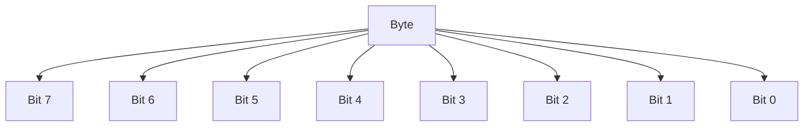
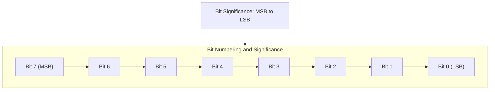
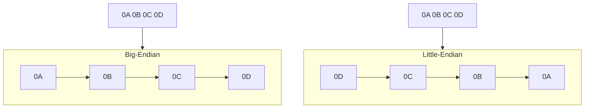

# Computer science

The code snippets are written in Go.

## Bits

A bit is the most basic unit of information in computer science. The name is a portmanteau (a blend of two words) of *binary digit*. A bit represents a logical state with one of two possible values, either "1" or "0". There are other semantic representations of bits as well, such as "true" or "false", "yes" or "no", "on" or "off", etc.

### Bytes and bit arrays

A contigious group of bits is commonly called a *bit string*, *bit vector*, or *bit array*. We're going to call it a *bit array* in this note. A group of eight bits is called a *byte*.

One byte can hold integer values from 0 to 255 (2^8 - 1). Even though 2^8 is 256, the first value is 0, and the last value is 255, so it holds 256 different values. *Octet* is another term for an 8-bit sequence due to historical reasons but it's not as commonly used.



#### Population

The *population* (sometimes *Hamming weight*) of a bit array or a bite is the number of bits set to 1.

#### Capacity

The *capacity* of a bit array is the number of bits it can hold. The capacity of a byte is 8 bits. The capacity can be calculated with the formula 2^n, where n is the number of bits in the bit array.

#### Sparsity and density

The *sparsity* and *density* of a bit array is the ratio of the number of bits set to 0 or 1, respectively, to the total number of bits in the bit array.

### Byte as the smallest addressable unit of memory

A byte is the smallest addressable unit of memory in a computer because it's the smallest unit that can be addressed individually by the CPU. This means that even if we need only need a single bit of information for a boolean value, we still need to allocate a whole byte of memory to store it. If we, for example, want to store a value of `true` to memory, we still need to store this as a byte with the value of `00000001` because we can't store a single bit in memory, meaning that seven of the eight bits are wasted. To store multiple boolean values in a single byte, and hence be more mindful about how to use the memory space, we can use bitwise operations to manipulate the bits in the byte, read more about this from the section [Bitwise operators](#bitwise-operation).

### Words

Computers usually manipulate bits in groups of fixed size, named *words*. In other words, it's the number of bits a CPU can deal with in one go. The number of bits in a word varies with the hardware design. Typically, the number of bits in a word is between 8 and 80 bits but nowadays the most retail personal or server computers have a word size of 32 or 64 bits. Computers with 32-bit words are called *32-bit computers* and computers with 64-bit words are called *64-bit computers*.

### Bit numbering and significance

When bits need to be indentified individually, they are usually numbered from right to left starting from 0. The rightmost bit is called the *least significant bit* (LSB) and the leftmost bit is called the *most significant bit* (MSB). The MSB is the bit that represents the largest value in the bit array. When one byte is in question, the MSB is the eighth bit with the possible value of 128 or 0, and the LSB is the first bit with the possible value of 0 or 1.



### Endianess

Endianess is the order of bytes in a word. There are two types of endianess: *big-endian* and *little-endian*. In big-endian, the most significant byte is stored at the smallest memory address and the least significant byte is stored at the largest memory address. In little-endian, the least significant byte is stored at the smallest memory address and the most significant byte is stored at the largest memory address. The terms *big-endian* and *little-endian* are derived from Jonathan Swift's novel *Gulliver's Travels*.



### Bitwise operation

A bitwise operation operates on individual bits of a bit array. You use something called *bit masks* to perform bitwise operations. A bit mask is a binary number that is used as a comparison value to the original binary number, and the result of that comparison is used to determine the output of the bitwise operation depending on the operation. This is also called *masking* or *bit masking*.

A useful use case for bitwise operations is when we need to store multiple boolean values in a single byte. One example of this is the Linux file permissions where the read, write, and execute permissions are stored in a single byte.

The most common bitwise operations are:

- `&`: bitwise AND, it returns 1 if both bits are 1
- `|`: bitwise OR, it returns 1 if at least one bit is 1
- `^`: bitwise XOR, it returns 1 if the bits are different
- `~`: bitwise NOT, it inverts the bits (`!` in Go)
- `&^`: bit clear (AND NOT), 
- `<<`: left shift
- `>>`: right shift

#### AND

The bitwise AND operation returns 1 if both bits are 1, otherwise it returns 0. With this operation, we can check if a specific bit is set in a byte. To represent this in a truth table, we can use the following:

| 6 | 4 | & |
|---|---|---|
| 1 | 1 | 1 |
| 1 | 0 | 0 |
| 0 | 0 | 0 |

We compare the bits in the same position in the two bytes and if both bits are 1, the result is 1, otherwise it's 0. With 7 and 6, the bytes are `00000111` and `00000110`. When we apply the AND operation, we get `00000110`, which is 6 in numeric value.

```go
package main

import "fmt"

func main() {
    a := 6
    b := 4
    c := a & b
    fmt.Println(c) // Output: 4
}
```

This can be used to check if, for example, a user has read permission to a file.

#### OR

The bitwise OR operation returns 1 if at least one bit is 1, otherwise it returns 0. With this operation, we can set a specific bit in a byte. To represent this in a truth table, we can use the following:

| 6 | 4 | \| |
|---|---|---|
| 1 | 1 | 1 |
| 1 | 0 | 1 |
| 0 | 0 | 0 |

We compare the bits in the same position in the two bytes and if at least one bit is 1, the result is 1, otherwise it's 0. With 6 and 4, the bytes are `00000110` and `00000100`. When we apply the OR operation, we get `00000110`, which is 6 in numeric value.

```go
package main

import "fmt"

func main() {
    a := 4
    b := 2
    c := a | b
    fmt.Println(c) // Output: 6
}
```

With this we can for example set the write permission to a file.

#### XOR

The bitwise XOR operation returns 1 if the bits are different, otherwise it returns 0. With this operation, we can toggle a specific bit in a byte. To represent this in a truth table, we can use the following:

| 6 | 4 | ^ |
|---|---|---|
| 1 | 1 | 0 |
| 1 | 0 | 1 |
| 0 | 0 | 0 |

We compare the bits in the same position in the two bytes and if the bits are different, the result is 1, otherwise it's 0. With 6 and 4, the bytes are `00000110` and `00000100`. When we apply the XOR operation, we get `00000010`, which is 2 in numeric value.

```go
package main

import "fmt"

func main() {
    a := 6
    b := 4
    c := a ^ b
    fmt.Println(c) // Output: 2
}
```

With this we can for example toggle the execute permission to a file. This would work with decimal numbers 7 and 1.

#### NOT

The bitwise NOT operation inverts the bits. With this operation, we can toggle all bits in a byte. To represent this in a truth table, we can use the following:

| 6 | ~ |
|---|---|
| 1 | 0 |
| 1 | 0 |
| 0 | 1 |

We invert the bits in the byte. With 6, the byte is `00000110`. When we apply the NOT operation, we get `11111001`, which is 249 in numeric value.

```go
package main

import "fmt"

func main() {
    a := 6
    c := ^a
    fmt.Println(c) // Output: 249
}
```

With this we can for example toggle all permissions to a file.

#### Bit clear (AND NOT)

The bitwise AND NOT operation clears the bits. With this operation, we can clear a specific bit in a byte. To represent this in a truth table, we can use the following:

| 6 | 4 | &^ |
|---|---|----|
| 1 | 0 | 0  |
| 1 | 1 | 1  |
| 0 | 1 | 0  |

We compare the bits in the same position in the two bytes and if the bit in the second byte is 1, the result is 0, otherwise it's the bit in the first byte. With 6 and 4, the bytes are `00000110` and `00000100`. When we apply the AND NOT operation, we get `00000010`, which is 2 in numeric value. This means we just cleared the bit 4 in the byte 6.

```go
package main

import "fmt"

func main() {
    a := 6
    b := 4
    c := a &^ b
    fmt.Println(c) // Output: 2
}
```

#### Left shift

The left shift operation shifts the bits to the left. To represent this in a table, we can use the following:

| Left-shift | 5 in binary | Result in binary | Result in decimal |
|------------|-------------|------------------|-------------------|
| 2          | 00000101    | 00010100         | 10                |

Note that the left shift discards the leftmost bits that are shifted out of the byte. So be careful with this operation if the leftmost bits are important.

#### Right shift

The right shift operation shifts the bits to the right. To represent this in a table, we can use the following:

| Right-shift | 5 in binary | Result in binary | Result in decimal |
|-------------|-------------|------------------|-------------------|
| 2           | 00000101    | 00000001         | 1                 |

Note that the right shift discards the rightmost bits that are shifted out of the byte. So be careful with this operation if the rightmost bits are important.
