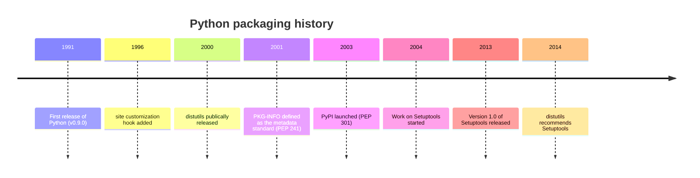

# Python

## Packaging

In general, packaging is the process of putting your code and its dependencies into a format that can be distributed and installed. This note will focus on how Python ecosystem handles packaging.

First, a bit of history is given, and then the current state of Python packaging is described with technical overview of the tools and standards.

### History

Here's an overview timeline of Python packaging history:

#### site-packages

During the early days of Python, in the 1990s, there was no standardized way to package and distribute Python code.

Perl already had a CPAN (Comprehensive Perl Archive Network) repository, and Python developers wanted something similar.

The way to get a shared Python library installed was to copy it to the disk and add the location to `sys.path`. First steps that were taken to have a standard Python packaging infrastructure was to define a common directory, where the libraries should be installed.

In 1996, a "site customization hook" was added to Python 1.4 beta 2 to help with this. You'd install a package in `$exec_prefix/lib/site-python` (`$exec_prefix` defaulted to `/usr/local`) and then import `site` module "near the top of their code", and the packages would be added to `sys.path`. The next year, in 1997, the `site` module was already being imported automatically during initialization by the Python interpreter. Nowadays, the installed packages directory is called `site-packages`.

#### distutils

In late 1998, Distutils SIG (special interest group) was formed to solve problems regarding non-standardized Python packaging and distributions.

A first version of a `distutils` module was committed to the Python standard library in version 1.5.2a2. It was part of the released Python 1.5.2 in 1999 but it was still a work in progress as a standard library module. As Python 2.0 was released in 2000, `distutils` was publically released in the standard library as the original and first official way to package and distribute Python code using a `setup.py` file. `distutils` provided utilities how to describe a Python distribution, how to create a source distribution (an archive with sources and run `setup.py`) or a binary distribution, versioning, etc. It was significant step forward and made installing, building and distributing third party packages much simples.

#### Metadata

Now that `distutils` was part of the standard library and Python ecosystem had a standard way to package and distribute code, there was a need to have a centralized catalog to store, search and distribute Python packages for the whole ecosystem. In 2000, Catalog SIG was started to address this issue.

What first needed to be done, was to define a metadata standard; how to describe a Python package: its name, version, dependencies, author, licenses, etc. In 2001, PEP 241 was written to define the metadata standard for Python packages. Metadata would be stored in a `PKG-INFO` file created by `distutils` with `setup.py stdist` command. The file would be included in the package distribution archive when running the command. In 2003, PEP 314 was written to update the metadata standard to version 1.1, and again in 2005, PEP 345 was written to update the metadata standard to version 1.2.

#### PyPI

After the metadata standard was defined, the implementation of Python Package Index, PyPI, started, and outlined in PEP 301, in late 2002. By 2003, PyPI was launched. Developers could now upload their packages to PyPI, and users could search and download packages from the index, and install them using `setup.py` thanks to `distutils`.

#### Setuptools

Even though `distutils` was a significant step forward, and the ecosystem now even had its own package index, there were some shortcomings with `distutils` that needed to be addressed.

`distutils` could not handle package dependencies. A developer needed to manually install dependencies before installing the package. This was a problem, as the package could have many dependencies, and the dependencies could have their own dependencies, and so on. This was a tedious and error-prone process. Documentation was also lacking. Also, a big problem was `distutils` being part of the standard library. `distutils` was hard to update and improve it, as it was tied to the Python release cycle. The community didn't receive updates and improvements as fast as they needed.

That lead to the development of a third-party (compared to Python and its standard library) solution that could add the needed features to the ecosystem. In 2004, work on a tool called Setuptools started. Setuptools was built as an extension on top of `distutils`, providing new features to the current tooling, and not creating a totally separate one.

On top of working on the automatic dependency installation, Setuptools also started to work on documentation and how to figure out what distributions are installed on the system. The latter was planned to be done by creating a database of installed distributions, as was already described in PEP 262 in 2001.

Version 1.0 of Setuptools was released in 2013, and from the release of Python 3.4 in 2014 onwards, `distutils` recommended using Setuptools instead of directly using `distutils`, in its standard library documentation.

### Links

This section lists links to official resources, tools and documentation about Python packaging.

- [Python Packaging Authority](https://www.pypa.io/)
- [Python Package Index](https://pypi.org/)
- [Python Packaging User Guide](https://packaging.python.org/)
- [pip](https://pip.pypa.io/)
- [distutils](https://docs.python.org/3.4/library/distutils.html)
- [Setuptools](https://setuptools.pypa.io/)

### PEPs

This section lists Python Enhancement Proposals (PEPs) that are related to Python packaging, and are mentioned in this note.

- [PEP 241 - Metadata for Python Software Packages](https://peps.python.org/pep-0241/)
- [PEP 262 - A Database of Installed Python Packages](https://peps.python.org/pep-0262/)
- [PEP 301 - Package Index and Metadata for Distutils](https://peps.python.org/pep-0301/)
- [PEP 314 - Metadata for Python Software Packages 1.1](https://peps.python.org/pep-0314/)
- [PEP 345 - Metadata for Python Software Packages 1.2](https://peps.python.org/pep-0345/)
- [PEP 632 - Deprecate distutils module](https://peps.python.org/pep-0632/)

### References

This section lists history references used in this note. They provide more detailed information about the topics discussed.

- [The brief history of package distribution in Python](https://medium.com/@knikitin/the-brief-history-of-package-distribution-in-python-5da35092964f)
- [History of packaging](https://the-hitchhikers-guide-to-packaging.readthedocs.io/en/latest/history.html)
- [Extra: A History of Python Build Tools](https://carpentries-incubator.github.io/python_packaging/instructor/04-history-of-packaging.html)
- [SIG for Python Resource Catalog](https://www.python.org/community/sigs/retired/catalog-sig/)
